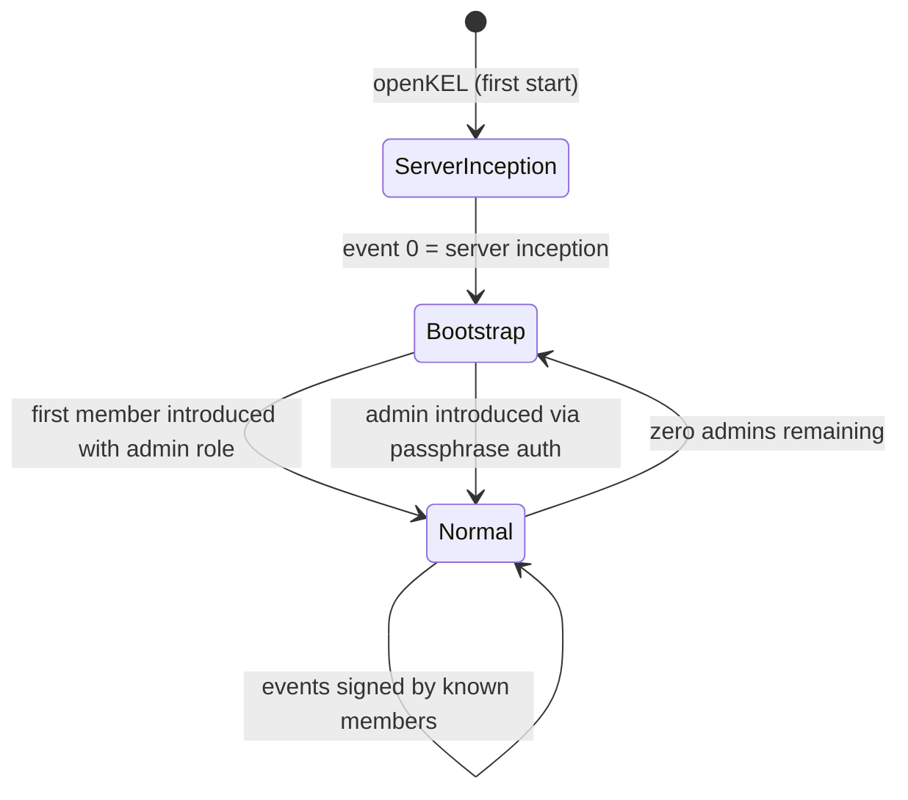
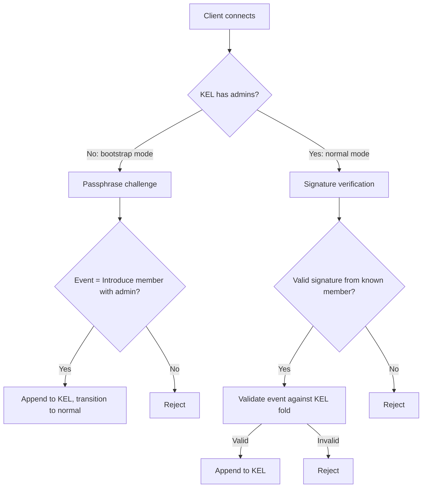
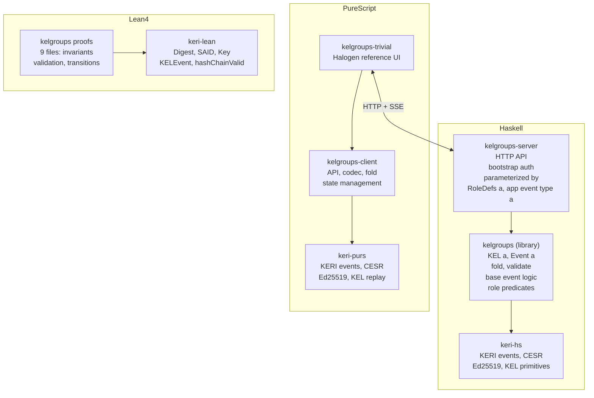
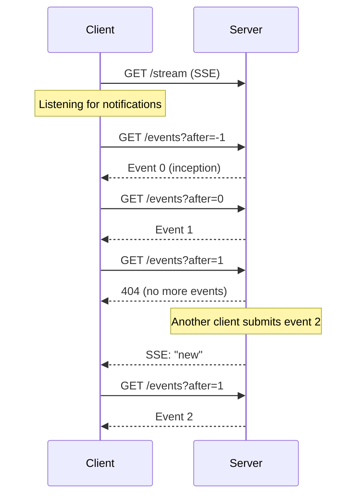
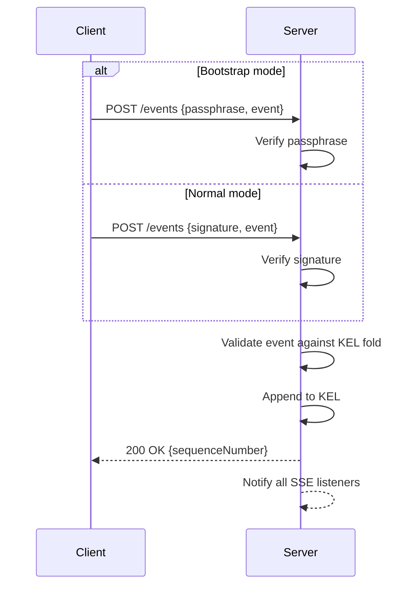

# kelgroups — Design Document

## 1. KEL Basics

A **Key Event Log (KEL)** is an append-only, hash-chained, signed event log. Each event carries:

- A **sequence number** (monotonically increasing)
- A **digest** of the prior event (hash chain)
- A **signature** from the event author

The KEL is a pure data structure. Folding it produces the **current condition** of the system — there is no mutable state outside the log. Validation of a new event always runs against the fold of the existing KEL.

## 2. Project Overview

`kelgroups` is a **polymorphic Haskell library** for managing groups via a KEL. The library is generic over application event types — the base system provides group infrastructure while applications supply domain-specific semantics.

### Packages

| Package | Language | Role |
|---|---|---|
| `kelgroups` | Haskell | Polymorphic base system library |
| `kelgroups-server` | Haskell | Server parameterized by application plugin |
| `kelgroups-client` | PureScript | Client-side KEL handling, API, and state |
| `kelgroups-trivial` | PureScript | Halogen reference UI |

### Dependencies

| Dependency | Language | Provides |
|---|---|---|
| [keri-hs](https://github.com/paolino/keri-hs) | Haskell | KERI events, CESR encoding, Ed25519 crypto, KEL primitives |
| [keri-purs](https://github.com/paolino/keri-purs) | PureScript | KERI events, CESR encoding, Ed25519 crypto, KEL replay |
| [keri-lean](https://github.com/paolino/keri-lean) | Lean 4 | Generic KERI types (`Digest`, `SAID`, `Key`, `KELEvent`, `hashChainValid`) |

The first instance is **trivial**: no application semantics, just the base system operating alone.

## 3. Invariants

- **One server = one group.** No multi-tenancy.
- **One KEL per group.** The server's KEL is the single source of truth.
- **Server condition = KEL fold.** Pure event-sourced — no side state.
- **No KEL reconciliation.** Single authoritative KEL, no forking or merging.
- **Validate before append.** Every new event is validated against the current KEL fold before being accepted.

## 4. Two Layers of Semantics

The KEL carries two kinds of events:

- **Base events** — infrastructure-level operations needed for the system to function (member management, role changes, voting).
- **Application events** — domain-specific, opaque to the base system.

The KEL type is `KEL a` where `a` is the application event type. The base system never inspects `a` — it only folds base events to maintain group state.

```haskell
data Event a
    = BaseEvent BaseEvent
    | AppEvent a
```

## 5. Roles

Two categories of roles exist:

- **Admin** — a distinguished base-system role. Admins vote on member and role changes.
- **Application roles** — opaque labels from the base system's perspective.

All role changes (including granting/revoking admin) require **admin majority vote**.

Application roles are defined at server startup via **role definitions** that include two predicates:

```haskell
data RoleDef a = RoleDef
    { canAdd :: KEL a -> Bool
    , canRemove :: KEL a -> Bool
    }
```

These predicates gate role assignment and removal based on the current KEL state. The server is parameterized by a map of role definitions:

```haskell
type RoleDefs a = Map RoleName (RoleDef a)
```

## 6. Base Events

| Event | Description | Requirement |
|---|---|---|
| **Introduce member** | Add a public key with a set of roles (including admin flag) | Admin majority vote |
| **Remove member** | Remove a member entirely | Admin majority vote |
| **Change roles** | Modify a member's role set | Admin majority vote |

Each of these operations follows a **proposal + approval** pattern: one admin proposes, then a majority of admins must approve before the event is appended to the KEL.

```haskell
data BaseEvent
    = Propose Proposal
    | Approve ProposalDigest

data Proposal
    = IntroduceMember PublicKey (Set Role)
    | RemoveMember PublicKey
    | ChangeRoles PublicKey (Set Role)
```

## 7. Bootstrap Mode



- **Event 0** is always the server's own KERI inception event (Ed25519 keypair generated on first start). The group identifier is the SAID of this event.
- **Empty members** or **zero admins** triggers bootstrap mode.
- The server receives a **passphrase via CLI arguments** at startup.
- In bootstrap mode, clients authenticate via **passphrase challenge** instead of signatures.
- The first client event (event 1) **must** introduce a member with the admin role — otherwise it is rejected.
- After the first admin is introduced, the system transitions to **normal mode** (signature-based auth).
- If all admins are removed, bootstrap mode **reactivates** — the passphrase is the permanent fallback. The system is never dead.



## 8. Authentication

| Mode | Mechanism | When |
|---|---|---|
| Bootstrap | Passphrase challenge | KEL has zero admins |
| Normal | Event signed by known member | KEL has at least one admin |

**Majority calculation** for admin votes: `ceil(numAdmins / 2)`. With a single admin, that admin decides alone.

## 9. Architecture



The server is assembled by supplying an **application plugin**:

```haskell
data AppPlugin a = AppPlugin
    { roleDefs :: RoleDefs a
    , decodeAppEvent :: ByteString -> Either String a
    , encodeAppEvent :: a -> ByteString
    }

runServer :: AppPlugin a -> Passphrase -> IO ()
```

For the trivial first instance, `a = Void` (no application events, no application roles).

## 10. HTTP Protocol

The server exposes a minimal HTTP API. No WebSockets — clients use **SSE** for notifications and **HTTP GET** for fetching events.

### Design Principles

- **SSE is notification-only** — carries no event payload, just a signal that new events exist
- **Clients pull events** — each client tracks its own position in the KEL and requests the next event
- **One event per request** — `GET` returns exactly the next event after the client's last known sequence number
- **POST to submit** — clients submit new events (signed or passphrase-authenticated)

### Endpoints

| Method | Path | Description |
|---|---|---|
| `GET` | `/events?after=N` | Returns event at sequence number N+1. 404 if no such event yet. |
| `POST` | `/events` | Submit a new signed event. Server validates and appends to KEL. |
| `GET` | `/stream` | SSE endpoint — sends empty notifications when new events are appended. |
| `GET` | `/condition` | Returns the current group condition (KEL fold result). |

### Event Retrieval Flow



### Event Submission



### SSE Format

The SSE stream sends minimal notifications:

```
event: new
data: {"sn": 5}

event: new
data: {"sn": 6}
```

The `sn` field tells the client which sequence number is now available, so it can decide whether to fetch.

## 11. Edge Cases

| Scenario | Behavior |
|---|---|
| Last admin removed | Zero admins — bootstrap mode reactivates, passphrase auth required |
| Bootstrap: introduce member without admin | Rejected — first event must grant admin |
| App role removal blocked by precondition | `canRemove` returns `False` — role change rejected |
| Proposal with no approvals | Stays pending until majority reached or superseded |
| Member signs event after removal | Signature valid but member unknown in current fold — rejected |
| Concurrent proposals for same member | Each proposal is independent, both need majority, applied in KEL order |
