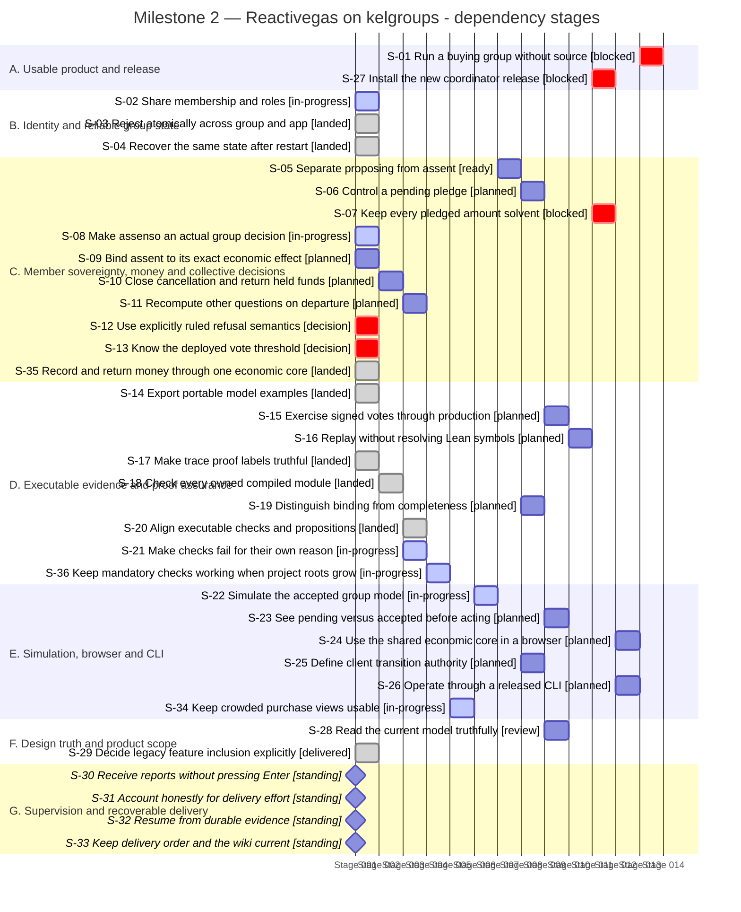

# Milestone 2 — Reactivegas on kelgroups

Last reconciled: **2026-09-06T16:04:42.816Z**. Team: **RUNNING**. [Milestone](https://github.com/paolino/reactivegas/milestone/2).

#90 is landed through PR95. #92 now has a quality-only candidate 8df63cf directly on master with all eleven author rows complete; a fresh Codex Sol quality supervisor is refreezing the first of two sequential Codex/Astra inspection packets, so the candidate is still unaccepted. PR94 remains the live public simulator gym and waits only on accepted/landed #92, combined mandatory CI and a fresh full simulator audit. Kelgroups S30-2D has one of four executions complete with the full gate passing; its sole Astra auditor is provider-capacity stalled and preserved unchanged under a new Codex Sol epic and ticket owner. #76 remains parked on #92, #68 and #71 remain in flight behind their existing dependencies, S3 semantic completeness remains open, and no coordinator/browser/CLI release is accepted. Active control roles have moved from Claude Opus to Codex Sol. No new ticket will start; prepared #69, #75, #81, #82, #83 and #84 remain parked.

> Stories describe outcomes; tickets are delivery containers. The mapping is many-to-many. Unticketed work, decisions and standing obligations are named explicitly. A landed enabler does not mean the product outcome is delivered.

## Delivery map

**Dependency-stage Gantt — not a calendar forecast.** Each equal-width bar occupies one dependency stage; positions are calculated from the prerequisites below. Synthetic dates are rendering coordinates only. Widths are not effort, duration or completion percentages. Standing obligations are checkpoints. Same-stage rows may be independent, but this chart grants no dispatch authority.

Labels report delivery state; only in-progress rows use active colouring.

State key: **landed/delivered** = evidence linked; **review/ready** = not landed; **blocked/decision** = unresolved prerequisite; **planned** = not commissioned; **standing** = continuing obligation.

## A. Usable product and release

| Story | Kind | Tracking | State | Owner |
|---|---|---|---|---|
| [S-01 Run a buying group without source](#s-01) | outcome | Ticketed — [Reactivegas #72](https://github.com/paolino/reactivegas/issues/72), [Reactivegas #43](https://github.com/paolino/reactivegas/issues/43), [Reactivegas #67](https://github.com/paolino/reactivegas/issues/67) | blocked | Milestone owner |
| [S-27 Install the new coordinator release](#s-27) | product | Ticketed — [Reactivegas #67](https://github.com/paolino/reactivegas/issues/67), [Reactivegas #51](https://github.com/paolino/reactivegas/issues/51) | blocked | Haskell delivery owner |

### S-01

**As a new group organiser, I want to download and run the complete service, so that my group can elect, collect, pledge, assent, purchase and refund.**

**Tracking:** Ticketed. Milestone outcome across several epics and tickets. Historical epic #43 remains open for traceability and is not being respawned; #72 is the current delivery map. [Reactivegas #72](https://github.com/paolino/reactivegas/issues/72), [Reactivegas #43](https://github.com/paolino/reactivegas/issues/43), [Reactivegas #67](https://github.com/paolino/reactivegas/issues/67).

**Now — blocked:** The required stranger journey has not been demonstrated on the new Haskell coordinator. Released browser and CLI clients are also required. Legacy releases, proofs and simulator runs do not establish this outcome.

**Acceptance:** An independent person downloads the released coordinator, browser and CLI and exercises all six actions with meaningful state effects and required refusals, without a source build.

**Dependencies:** [S-27: Install the new coordinator release](#s-27); [S-24: Use the shared economic core in a browser](#s-24); [S-26: Operate through a released CLI](#s-26); [S-28: Read the current model truthfully](#s-28); [S-29: Decide legacy feature inclusion explicitly](#s-29)

**Next:** Follow the accepted dependency sequence; close the milestone only on the released user journey.

**Evidence:** No completion evidence claimed.

### S-27

**As an installing operator, I want the familiar archive entrypoint to run the new coordinator, so that installation is reproducible and the downloaded identity is verifiable.**

**Tracking:** Ticketed. #67 covers implementation and coordinator delivery; #51 retains separate release-identity obligations. A green release workflow alone is not product acceptance. [Reactivegas #67](https://github.com/paolino/reactivegas/issues/67), [Reactivegas #51](https://github.com/paolino/reactivegas/issues/51).

**Now — blocked:** The settled package is a Reactivegas-owned Cabal executable linking the kelgroups library and Reactivegas app at build time. Archive naming and bin/server stay, but their new bytes require new evidence. D2-D5 remain unfinished; legacy provisional release #49 is historical.

**Acceptance:** Bind the new archive to accepted source; independently fetch and run it, including the six-step coordinator journey and exact release identity.

**Dependencies:** [S-03: Reject atomically across group and app](#s-03); [S-04: Recover the same state after restart](#s-04); [S-06: Control a pending pledge](#s-06); [S-08: Make assenso an actual group decision](#s-08); [S-10: Close cancellation and return held funds](#s-10); [S-16: Replay without resolving Lean symbols](#s-16)

**Next:** Complete substrate integration, economic implementation and API, then repeat release verification on the actual new artifact.

**Evidence:** [Reactivegas #49](https://github.com/paolino/reactivegas/issues/49)

## B. Identity and reliable group state

| Story | Kind | Tracking | State | Owner |
|---|---|---|---|---|
| [S-02 Share membership and roles](#s-02) | product | Ticketed — [Reactivegas #62](https://github.com/paolino/reactivegas/issues/62), [Reactivegas #73](https://github.com/paolino/reactivegas/issues/73), [kelgroups #29](https://github.com/paolino/kelgroups/issues/29), [kelgroups #30](https://github.com/paolino/kelgroups/issues/30), [kelgroups #33](https://github.com/paolino/kelgroups/issues/33), [kelgroups #34](https://github.com/paolino/kelgroups/issues/34) | in-progress | Codex Sol Kelgroups epic owner |
| [S-03 Reject atomically across group and app](#s-03) | enabler | Ticketed — [kelgroups #28](https://github.com/paolino/kelgroups/issues/28), [kelgroups #29](https://github.com/paolino/kelgroups/issues/29), [Reactivegas #73](https://github.com/paolino/reactivegas/issues/73) | landed | Kelgroups ticket owner |
| [S-04 Recover the same state after restart](#s-04) | product | Ticketed — [kelgroups #28](https://github.com/paolino/kelgroups/issues/28), [Reactivegas #73](https://github.com/paolino/reactivegas/issues/73) | landed | Kelgroups ticket owner |

### S-02

**As a group member, I want one identity and membership state across the system, so that permissions do not disagree between the group engine and economics.**

**Tracking:** Ticketed. The model ticket is closed and #28 landed. The cross-repository story remains unfinished under #73 and kelgroups #29, including vote interface #30, runnable demonstration #33 and release/downstream notes #34. These are delivery containers, not extra completion claims. [Reactivegas #62](https://github.com/paolino/reactivegas/issues/62), [Reactivegas #73](https://github.com/paolino/reactivegas/issues/73), [kelgroups #29](https://github.com/paolino/kelgroups/issues/29), [kelgroups #30](https://github.com/paolino/kelgroups/issues/30), [kelgroups #33](https://github.com/paolino/kelgroups/issues/33), [kelgroups #34](https://github.com/paolino/kelgroups/issues/34).

**Now — in-progress:** Kelgroups #28 and S30-1 are landed. S30-2 candidate bdeba37a remains byte-identical and no product defect has been demonstrated. Evidence-only S30-2D has one sole Codex/Astra launch: execution 1/4 ran the complete gate and passed; executions 2-4 remain unspent. The same live auditor is provider-capacity stalled and is preserved without input, retry, model switch or replacement under the fresh Codex Sol epic %641 and ticket owner %642; the predecessor Opus panes are retired.

**Acceptance:** The accepted group engine and economic application consume the same membership/role view, with integrated permission and refusal witnesses.

**Dependencies:** No prerequisite story recorded; this is not dispatch authority.

**Next:** Let the same S30-2D auditor resume or terminalize. Run only its original remaining three executions, adjudicate once against the unchanged candidate, and land only if every required row passes. Start no other Kelgroups ticket.

**Evidence:** [Reactivegas #62](https://github.com/paolino/reactivegas/issues/62), [Landed kelgroups integrated API — PR32](https://github.com/paolino/kelgroups/pull/32), [Accepted S30-1 candidate — draft PR35](https://github.com/paolino/kelgroups/pull/35)

### S-03

**As an application developer, I want invalid integrated events to be refused atomically, so that a refusal cannot leave a partially updated group.**

**Tracking:** Ticketed. Implementation slice of kelgroups #28. The broader substrate epic also includes #30; this candidate is not acceptance of the whole epic. [kelgroups #28](https://github.com/paolino/kelgroups/issues/28), [kelgroups #29](https://github.com/paolino/kelgroups/issues/29), [Reactivegas #73](https://github.com/paolino/reactivegas/issues/73).

**Now — landed:** PR32 merged as933e385 on accepted368b596. The landed tree is byte-identical to the full independently audited ab25cd1 candidate; GitHub signature verification succeeds. Candidate remote CI passed; post-merge CI passed. All six required rows and five reliances were assessed within the stated finite scope, and the desk verified the135-file audit inventory. Broader #29/#73 completion remains separate.

**Acceptance:** Exercise each integrated path and rejection; independently demonstrate that disabling the membership check, hook refusal or other guarded effect breaks its stated acceptance row.

**Dependencies:** No prerequisite story recorded; this is not dispatch authority.

**Next:** Kelgroups #28 is closed after scope acceptance. Preserve its landed guarantees while preparing #30 and the remaining #73 contract before downstream Haskell integration.

**Evidence:** [Landed kelgroups integrated API — PR32](https://github.com/paolino/kelgroups/pull/32)

### S-04

**As a group organiser, I want event replay to recover the accepted live state, so that restarting cannot change the interpretation of group history.**

**Tracking:** Ticketed. This story is a slice of the linked delivery work; the issue may cover other stories too. [kelgroups #28](https://github.com/paolino/kelgroups/issues/28), [Reactivegas #73](https://github.com/paolino/reactivegas/issues/73).

**Now — landed:** Fresh independent evidence on the final candidate demonstrates conservation and actual database close/reopen across 160 tested concurrent schedules; the deliberately broken version loses updates in the paired experiment. The shipped concurrency checker independently fails on that defect and passes on the candidate. This is finite local assurance; crash/interruption between SQL and memory commits and separate-handle concurrency remain outside the established result. This bounded result landed in PR32 with an identical audited tree. Post-merge CI passed; no broader crash-safety claim follows.

**Acceptance:** Reopen a persisted log and recover exactly the live state; reject changed founding inputs and detect a mutant that leaves live state stale.

**Dependencies:** No prerequisite story recorded; this is not dispatch authority.

**Next:** Preserve the landed replay/refusal guarantees and exercise them again at the later Haskell integration boundary.

**Evidence:** [Landed kelgroups integrated API — PR32](https://github.com/paolino/kelgroups/pull/32)

## C. Member sovereignty, money and collective decisions

| Story | Kind | Tracking | State | Owner |
|---|---|---|---|---|
| [S-05 Separate proposing from assent](#s-05) | product | Ticketed — [Reactivegas #68](https://github.com/paolino/reactivegas/issues/68) | ready | Proposer-assent ticket owner |
| [S-06 Control a pending pledge](#s-06) | product | Ticketed — [Reactivegas #69](https://github.com/paolino/reactivegas/issues/69) | planned | Milestone owner until commissioning |
| [S-07 Keep every pledged amount solvent](#s-07) | product | Ticketed — [Reactivegas #67](https://github.com/paolino/reactivegas/issues/67), [Reactivegas #66](https://github.com/paolino/reactivegas/issues/66) | blocked | Haskell delivery owner |
| [S-08 Make assenso an actual group decision](#s-08) | product | Ticketed — [Reactivegas #76](https://github.com/paolino/reactivegas/issues/76) | in-progress | Milestone owner until commissioning |
| [S-09 Bind assent to its exact economic effect](#s-09) | product | Ticketed — [Reactivegas #76](https://github.com/paolino/reactivegas/issues/76) | planned | Future composition ticket owner |
| [S-10 Close cancellation and return held funds](#s-10) | product | Ticketed — [Reactivegas #81](https://github.com/paolino/reactivegas/issues/81), [Reactivegas #76](https://github.com/paolino/reactivegas/issues/76) | planned | Milestone owner until commissioning |
| [S-11 Recompute other questions on departure](#s-11) | product | Ticketed — [Reactivegas #81](https://github.com/paolino/reactivegas/issues/81) | planned | Future lifecycle ticket owner |
| [S-12 Use explicitly ruled refusal semantics](#s-12) | product | Decision — [Reactivegas #81](https://github.com/paolino/reactivegas/issues/81), [Reactivegas #76](https://github.com/paolino/reactivegas/issues/76) | decision | Operator |
| [S-13 Know the deployed vote threshold](#s-13) | product | Decision — [Reactivegas #75](https://github.com/paolino/reactivegas/issues/75), [Reactivegas #67](https://github.com/paolino/reactivegas/issues/67) | decision | Operator |
| [S-35 Record and return money through one economic core](#s-35) | product | Ticketed — [Reactivegas #90](https://github.com/paolino/reactivegas/issues/90), [Reactivegas #67](https://github.com/paolino/reactivegas/issues/67) | landed | Haskell delivery owner |

### S-05

**As a group administrator, I want opening and approving a proposal to be distinct, so that opening a question does not silently contribute assent.**

**Tracking:** Ticketed. This story is a slice of the linked delivery work; the issue may cover other stories too. [Reactivegas #68](https://github.com/paolino/reactivegas/issues/68).

**Now — ready:** An audited candidate is ready in PR80 with green remote CI, but remains unmerged. Opening contributes zero assent; the ruled sole-admin case requires a separate explicit approval. The majority formula is unchanged.

**Acceptance:** Land the exact accepted candidate and demonstrate the ruled multi-admin and sole-admin behaviours in integrated reachable examples.

**Dependencies:** [S-22: Simulate the accepted group model](#s-22)

**Next:** Hold for the reserved simulator C1 landing, then recheck the exact candidate before any merge.

**Evidence:** [PR 80](https://github.com/paolino/reactivegas/pull/80)

### S-06

**As a contributing member, I want to create, correct or retract my own pending pledge, so that my money remains under the ruled authority while it is pending.**

**Tracking:** Ticketed. #69 is the current delivery ticket. Historical #48 work is superseded; its closure does not fulfil this remaining story. [Reactivegas #69](https://github.com/paolino/reactivegas/issues/69).

**Now — planned:** Intake is prepared; implementation has not been commissioned. Zero must refund escrow and remove the pending entry. Accepted pledges have a different referente authority boundary. Closed historical #48 is not authority to revive its retired departure design.

**Acceptance:** Prove and exercise own-pledge changes, zero/refund/removal, and the post-acceptance boundary with current traces and independent audit.

**Dependencies:** [S-05: Separate proposing from assent](#s-05)

**Next:** Commission on the accepted proposer-assent base.

**Evidence:** No completion evidence claimed.

### S-07

**As a contributor, I want escrow and spending to be accounted for consistently, so that funds cannot be spent twice or beyond available balances.**

**Tracking:** Ticketed. This story is a slice of the linked delivery work; the issue may cover other stories too. [Reactivegas #67](https://github.com/paolino/reactivegas/issues/67), [Reactivegas #66](https://github.com/paolino/reactivegas/issues/66).

**Now — blocked:** The milestone rules escrow at pledge, per-responsabile casse and enforced solvency. Lean laws and traces cover portions; they are not proof that the new released Haskell coordinator enforces the complete economic contract.

**Acceptance:** Exercise valid spending, rejected overspending and repeated spending against the real implementation, with balances and escrow checked after each outcome.

**Dependencies:** [S-03: Reject atomically across group and app](#s-03); [S-06: Control a pending pledge](#s-06); [S-08: Make assenso an actual group decision](#s-08); [S-16: Replay without resolving Lean symbols](#s-16)

**Next:** Implement the economic replay consumer and required refusal paths after the substrate is accepted.

**Evidence:** No completion evidence claimed.

### S-08

**As a group member, I want economic permission to come from a completed vote, so that one responsabile cannot impersonate collective assent.**

**Tracking:** Ticketed. #76 explicitly carries unfinished runtime work beyond closed #54; it is not a duplicate or an open product ruling about unilateral grants. [Reactivegas #76](https://github.com/paolino/reactivegas/issues/76).

**Now — in-progress:** The #76 Sol continuation preserved producer-derived authorization. A17 compiled the arbitrary-state equivalence, passed all 14 inversion/tightness rows and all 22 composition evaluations, then stopped at mirror coverage. CompositionTests is the exact #92 registered-root defect, so source is parked unchanged on accepted and landed #92. ProductionHistory is bound to one exact arbitrary-state exception after wake, with a deletion control; finite supplied-history validation is now recorded as an open #66 S5/#75 obligation. Spend remains 12/27 shared and 12/19 author.

**Acceptance:** Reachable unbacked and fabricated grants are refused; legitimate vote-derived grant/deny and the second economic consumer work through the production transition.

**Dependencies:** No prerequisite story recorded; this is not dispatch authority.

**Next:** Wait for accepted #92 landing, rebind the complete candidate, run the ProductionHistory deletion control and restored full gate, then A06 and hash-bound inspection. Add no umbrella import or local root workaround.

**Evidence:** [Planning draft PR93; implementation not yet accepted](https://github.com/paolino/reactivegas/pull/93)

### S-09

**As an approving member, I want a decision to authorise only the target and amount approved, so that another target, polarity or repeated use cannot borrow my assent.**

**Tracking:** Ticketed. This story is a slice of the linked delivery work; the issue may cover other stories too. [Reactivegas #76](https://github.com/paolino/reactivegas/issues/76).

**Now — planned:** The acceptance contract binds provenance, target, payload, polarity and one-use consumption for both economic consumers. A matching question label with caller-supplied amount is insufficient; backdonation must bind the ruled per-member share.

**Acceptance:** Demonstrate wrong-target, wrong-amount, wrong-polarity, fabricated and reused closure refusals; deliberately bypassing each binding must break its witness.

**Dependencies:** No prerequisite story recorded; this is not dispatch authority.

**Next:** Implement these rows as part of the composition candidate and expose them to replay.

**Evidence:** No completion evidence claimed.

### S-10

**As a member with an open question, I want renunciation or proposer departure to close it correctly, so that the question and any escrow are not silently stranded.**

**Tracking:** Ticketed. This story is a slice of the linked delivery work; the issue may cover other stories too. [Reactivegas #81](https://github.com/paolino/reactivegas/issues/81), [Reactivegas #76](https://github.com/paolino/reactivegas/issues/76).

**Now — planned:** The ruled work closes negatively, retains the closure and records the correct cause. Continuation and refund depend on runtime composition. Deleting the question is insufficient.

**Acceptance:** Renounce and departure produce retained negative closures; the linked economic continuation refunds correctly and atomically.

**Dependencies:** [S-08: Make assenso an actual group decision](#s-08)

**Next:** Implement the independently testable lifecycle rows, then finish continuation/refund with accepted composition.

**Evidence:** No completion evidence claimed.

### S-11

**As a remaining member, I want franchise changes to recompute other open questions, so that one proposer leaving does not disable legitimate decisions elsewhere.**

**Tracking:** Ticketed. This story is a slice of the linked delivery work; the issue may cover other stories too. [Reactivegas #81](https://github.com/paolino/reactivegas/issues/81).

**Now — planned:** The corrected acceptance requires coexistence: the departing proposer’s question closes negatively, while an unrelated threshold-crossing question may close through franchise change. The causes remain distinct.

**Acceptance:** A single departure demonstrates both closures where applicable; suppressing either closure or collapsing their causes must fail the witness.

**Dependencies:** [S-10: Close cancellation and return held funds](#s-10)

**Next:** Keep this coexistence row in the lifecycle implementation and integrated corpus.

**Evidence:** No completion evidence claimed.

### S-12

**As a voter, I want acceptance and refusal rules to be explicit, so that suggestive error names cannot silently decide product policy.**

**Tracking:** Decision. Decision record, not a commissioned ticket. Links provide neighbouring scope only; they do not decide these questions. [Reactivegas #81](https://github.com/paolino/reactivegas/issues/81), [Reactivegas #76](https://github.com/paolino/reactivegas/issues/76).

**Now — decision:** Non-proposer renounce refusal and non-designee ballot refusal remain unruled. Dormant constructors do not create authority. Existing accepted-but-non-deciding behaviour also does not authorise widening. These choices do not block the already-ruled lifecycle work.

**Acceptance:** Any change to these boundaries cites an explicit ruling and gains a corresponding implementation and acceptance contract.

**Dependencies:** No prerequisite story recorded; this is not dispatch authority.

**Next:** Keep current boundaries until a ruling is needed; resolve separately from the required lifecycle work.

**Evidence:** No completion evidence claimed.

### S-13

**As a group organiser, I want the voting policy to be explicit, so that identical ballots have a predictable supported verdict.**

**Tracking:** Decision. Operator decision with downstream tickets, not a standalone implementation ticket or an implicit #68 ruling. [Reactivegas #75](https://github.com/paolino/reactivegas/issues/75), [Reactivegas #67](https://github.com/paolino/reactivegas/issues/67).

**Now — decision:** No shipped threshold default is selected. Simulator legacyThreshold and zeroThreshold test exhibits are not deployment rulings. Permission questions do not consult the collective threshold.

**Acceptance:** A ruled default or explicit supported configuration is bound into the accepted coordinator and final collective-vote corpus.

**Dependencies:** No prerequisite story recorded; this is not dispatch authority.

**Next:** Operator choice is pending: require explicit setup policy without a default (recommended), ship legacyThreshold, or ship strict majority. Keep current model work parameterized; no choice is inferred from silence.

**Evidence:** No completion evidence claimed.

### S-35

**As a member or cashier, I want deposits, withdrawals, cashier transfers and donations to update the right balances together, so that cash custody and account balances stay consistent and invalid actions are refused.**

**Tracking:** Ticketed. First D2 implementation slice, ticket #90 under #67. It does not close integrated D2/D3 or the wider escrow story. [Reactivegas #90](https://github.com/paolino/reactivegas/issues/90), [Reactivegas #67](https://github.com/paolino/reactivegas/issues/67).

**Now — landed:** #90 landed through PR95 as merge 890a74f with tree 0f40463d byte-identical to the accepted e2ea8b8 candidate and sole parent efef604d. Exact-head remote CI and artifact packaging passed; GitHub reports a valid verified signature. The four-arm implementation, 49 local examples and 9/32 replay limit remain the established scope.

**Acceptance:** One production pure core implements all four arms; step-addressed partial corpus replay and direct applied/refused/frame-condition tests pass under actual CI, with distinguishing negative controls and independent inspection. Shared native/wasm architecture retained; actual wasm acceptance remains #82.

**Dependencies:** No prerequisite story recorded; this is not dispatch authority.

**Next:** Preserve the landed four-arm guarantees while completing the vote-derived composition and coordinator integration; #90 does not by itself establish all fourteen core actions, wasm or the released product journey.

**Evidence:** [Money-custody delivery — PR95](https://github.com/paolino/reactivegas/pull/95)

## D. Executable evidence and proof assurance

| Story | Kind | Tracking | State | Owner |
|---|---|---|---|---|
| [S-14 Export portable model examples](#s-14) | enabler | Ticketed — [Reactivegas #86](https://github.com/paolino/reactivegas/issues/86), [Reactivegas #74](https://github.com/paolino/reactivegas/issues/74) | landed | Haskell delivery owner |
| [S-15 Exercise signed votes through production](#s-15) | enabler | Ticketed — [Reactivegas #75](https://github.com/paolino/reactivegas/issues/75) | planned | Milestone owner until commissioning |
| [S-16 Replay without resolving Lean symbols](#s-16) | enabler | Ticketed — [Reactivegas #75](https://github.com/paolino/reactivegas/issues/75) | planned | Future vote-corpus ticket owner |
| [S-17 Make trace proof labels truthful](#s-17) | enabler | Ticketed — [Reactivegas #66](https://github.com/paolino/reactivegas/issues/66) | landed | Lean quality owner |
| [S-18 Check every owned compiled module](#s-18) | enabler | Ticketed — [Reactivegas #66](https://github.com/paolino/reactivegas/issues/66) | landed | Lean quality owner |
| [S-19 Distinguish binding from completeness](#s-19) | enabler | Ticketed — [Reactivegas #66](https://github.com/paolino/reactivegas/issues/66) | planned | Lean quality owner |
| [S-20 Align executable checks and propositions](#s-20) | enabler | Ticketed — [Reactivegas #66](https://github.com/paolino/reactivegas/issues/66) | landed | Lean quality owner |
| [S-21 Make checks fail for their own reason](#s-21) | enabler | Ticketed — [Reactivegas #66](https://github.com/paolino/reactivegas/issues/66) | in-progress | Lean quality owner |
| [S-36 Keep mandatory checks working when project roots grow](#s-36) | enabler | Ticketed — [Reactivegas #92](https://github.com/paolino/reactivegas/issues/92), [Reactivegas #66](https://github.com/paolino/reactivegas/issues/66) | in-progress | Codex Sol Lean quality owner |

### S-14

**As a Haskell implementer, I want frozen model examples and manifests, so that I can compare implementation behaviour with the Lean specification.**

**Tracking:** Ticketed. #86 is completed; #74 is closed as superseded, not completed. The landed exporter does not fulfil integrated vote replay or final economic conformance. [Reactivegas #86](https://github.com/paolino/reactivegas/issues/86), [Reactivegas #74](https://github.com/paolino/reactivegas/issues/74).

**Now — landed:** PR87 landed the exporter successor. Automated invocation, declared jq tooling, whole-wrapper value checks and malformed-arity refusal were repaired. Economic and integrated corpora remain provisional on later semantics and replay context. Old #74 was superseded without accepting its candidates.

**Acceptance:** The accepted exporter reproduces the bounded schema and refuses the measured integrity defects through the committed validation path; later semantic changes require recorded re-emission.

**Dependencies:** No prerequisite story recorded; this is not dispatch authority.

**Next:** Re-emit only when an accepted dependency changes the corpus and its owner releases that specific work.

**Evidence:** [PR 87](https://github.com/paolino/reactivegas/pull/87)

### S-15

**As a conformance reviewer, I want the reference corpus to traverse the production vote route, so that vote coverage describes the machine that will be implemented.**

**Tracking:** Ticketed. This story is a slice of the linked delivery work; the issue may cover other stories too. [Reactivegas #75](https://github.com/paolino/reactivegas/issues/75).

**Now — planned:** The two landed corpora have no signed vote events. Integrated franchise-change closure is covered. Separate simulator signed-vote examples are real coverage, but not a substitute for the production Reactivegas.apply route and final manifest.

**Acceptance:** An additive corpus drives signed votes through production, covers discovered observable constructors/refusals and incorporates accepted composition/lifecycle behaviour.

**Dependencies:** [S-05: Separate proposing from assent](#s-05); [S-06: Control a pending pledge](#s-06); [S-08: Make assenso an actual group decision](#s-08); [S-10: Close cancellation and return held funds](#s-10); [S-13: Know the deployed vote threshold](#s-13); [S-14: Export portable model examples](#s-14)

**Next:** Reuse existing vote journeys where applicable, then freeze only against accepted semantics and an explicit policy.

**Evidence:** [Reactivegas #57](https://github.com/paolino/reactivegas/issues/57)

### S-16

**As a replayer author, I want all operative policy inputs as portable data, so that replay does not depend on a Lean source tree or a guessed policy.**

**Tracking:** Ticketed. This story is a slice of the linked delivery work; the issue may cover other stories too. [Reactivegas #75](https://github.com/paolino/reactivegas/issues/75).

**Now — planned:** The prepared contract carries a finite per-corpus threshold table and explicit authentication context. It distinguishes pre-replay refusal, runtime out-of-domain abort and behavioural mismatch. Source metadata is provenance, not authority.

**Acceptance:** Lean independently evaluates the live policy against emitted bytes; malformed context and missing queried entries refuse/abort correctly; a witnessed wrong collective policy mismatches.

**Dependencies:** [S-15: Exercise signed votes through production](#s-15)

**Next:** Implement the frozen contract, including actual generator-input discovery and a precise source-input digest encoding.

**Evidence:** No completion evidence claimed.

### S-17

**As a proof reviewer, I want a trace label to resolve to its actual theorem, so that proved behaviour is neither falsely unproved nor falsely certified.**

**Tracking:** Ticketed. S1 slice of open #66 only; landing this story does not close the broader quality issue. [Reactivegas #66](https://github.com/paolino/reactivegas/issues/66).

**Now — landed:** PR79 landed the S1 trace resolver and totality repair. Re-emission replaced the incorrect withdrawal UNPROVED label. Panic-string absence was tested because the tool could emit panics while exiting zero.

**Acceptance:** The accepted resolver binds actual declarations and avoids the introduced elaborator panic; this does not establish completeness of every theorem statement.

**Dependencies:** No prerequisite story recorded; this is not dispatch authority.

**Next:** Preserve this accepted result while the remaining quality slices are completed.

**Evidence:** [PR 79](https://github.com/paolino/reactivegas/pull/79)

### S-18

**As a maintainer, I want the mandatory build to reject forbidden assumptions across owned modules, so that namespace or discovery shortcuts cannot leave proof holes.**

**Tracking:** Ticketed. S2R slice of #66, replacing rejected earlier campaigns; their receipts are evidence inputs, never inherited acceptance. [Reactivegas #66](https://github.com/paolino/reactivegas/issues/66).

**Now — landed:** PR88 merged21:12:18Z as3590c0015b84fd58004bf6fb44dd18b107304c48, singleparentd670323 and tree44a1f0bce4796c63203070e23b96172a7774956e equal to auditedab617d8, signature verified. Desk independently verified the actual merge_guard invocation and allsix passed guards. Candidate remoteCI and independent32-row audit passed; all53 final manifest entries verified. The new execution supplement is distinguished from retained38-call evidence. Physical-layout/shared-filter/auxiliary-branch limits remain, and #66 stays OPEN for S3–S5. Post-merge CI has now completed successfully.

**Acceptance:** Fresh full audit assesses all mandatory rows, omission controls and declared limits on the exact final candidate; only accepted bytes may land.

**Dependencies:** [S-14: Export portable model examples](#s-14); [S-17: Make trace proof labels truthful](#s-17)

**Next:** Preserve the accepted S2R base in C1 and quality work; post-merge CI is already successful. Re-establish affected evidence at future accepted integrations.

**Evidence:** [Landed PR88](https://github.com/paolino/reactivegas/pull/88), [Accepted source3590c001](https://github.com/paolino/reactivegas/commit/3590c0015b84fd58004bf6fb44dd18b107304c48)

### S-19

**As a person relying on proofs, I want coverage claims to name exactly what was established, so that a registered theorem is not mistaken for complete product assurance.**

**Tracking:** Ticketed. This story is a slice of the linked delivery work; the issue may cover other stories too. [Reactivegas #66](https://github.com/paolino/reactivegas/issues/66).

**Now — planned:** The record separates fourteen bindings, six machine-checked converses and assessed exactness. Three measured omissions in inversions are carried into statement-completeness work. Forward implications may remain true while their characterisation is incomplete.

**Acceptance:** Assess exact premises versus necessary conditions per consumer, retention and other statement gaps, without claiming missing reachability evidence as a reachable violation.

**Dependencies:** [S-05: Separate proposing from assent](#s-05); [S-18: Check every owned compiled module](#s-18)

**Next:** Complete the S5 assessment against the accepted model and retain owned gaps explicitly.

**Evidence:** No completion evidence claimed.

### S-20

**As a developer, I want relevant Boolean checks to agree with their propositions, so that execution and proofs test the same condition.**

**Tracking:** Ticketed. This story is a slice of the linked delivery work; the issue may cover other stories too. [Reactivegas #66](https://github.com/paolino/reactivegas/issues/66).

**Now — landed:** The bounded S4 correspondence slice landed in PR89 at efef604d; master tree equals the accepted candidate. This does not settle S3 mutation adequacy or S5 statement completeness.

**Acceptance:** Discover and justify the required finite correspondence relations; validate them through the mandatory path and independently test meaningful definition changes.

**Dependencies:** [S-18: Check every owned compiled module](#s-18)

**Next:** Use the accepted base in S3 and simulator validation; retain named S4 limitations.

**Evidence:** [S4 draft PR89](https://github.com/paolino/reactivegas/pull/89), [S4 landed PR89; accepted tree preserved](https://github.com/paolino/reactivegas/pull/89)

### S-21

**As an auditor, I want each deliberate defect to exercise the actual guarded path, so that green controls provide meaningful assurance.**

**Tracking:** Ticketed. This story is a slice of the linked delivery work; the issue may cover other stories too. [Reactivegas #66](https://github.com/paolino/reactivegas/issues/66).

**Now — in-progress:** The Codex Astra S3 successor completed its full owner schedule and a fresh Grok 4.6 audit returned findings, cumulative 21/22 with the product audit unit unspent. Seven repaired instrument requirements now hold, including a real wrong-span classifier and comparator controls. The audit also found setupAndRestoreIncluded is tautological. The larger semantic rows remain open: 127 atoms, 561 ownership relations, one executed historical mutation, source rather than compiled census, and helper recipes that are not elaborated witnesses.

**Acceptance:** Every claimed mutant kill identifies the changed production definition, affected obligation, actual command and intended failure. A nonempty blocked set is allowed and named.

**Dependencies:** [S-18: Check every owned compiled module](#s-18)

**Next:** Owner #66 must adjudicate the terminal report as a semantic-completeness remainder rather than another instrument patch loop. Keep S3 unaccepted and #66 open; define an executable bounded successor only if those semantic denominators can be measured.

**Evidence:** No completion evidence claimed.

### S-36

**As a maintainer integrating the simulator, I want legitimate registered Lean drivers to be checked through mandatory CI, so that adding an owned module neither breaks CI spuriously nor escapes assurance.**

**Tracking:** Ticketed. Quality checker integration repair, separate from accepted S4 correspondence and S3 recovery. [Reactivegas #92](https://github.com/paolino/reactivegas/issues/92), [Reactivegas #66](https://github.com/paolino/reactivegas/issues/66).

**Now — in-progress:** #92 submission 1 at 580e3d5 remains rejected. The corrected quality-only candidate 8df63cf, tree 4ccc8c6, is directly on master 890a74f and changes exactly four quality paths. Fresh Grok owner %633 completed all eleven author rows on the first submission, including native root qualification, seven can-fail rows, shipped-path B-minus-S refusal, its disabling control, and full combined-tree just ci. A fresh Codex Sol supervisor is versioning and refreezing sequential I1 then I2 Codex/Astra packets because the predecessor Opus-commissioned I1 packet was never launched. No inspection verdict or acceptance exists yet.

**Acceptance:** Actual C1 integration passes mandatory CI; newly registered roots are supported; independently omitted imports and a disabled checker are detected without removing required checks or misclassifying project ownership.

**Dependencies:** [S-20: Align executable checks and propositions](#s-20)

**Next:** Launch I1 and I2 sequentially from complete refrozen packets, adjudicate their full-candidate verdicts, run only already-authorized bounded repair if needed, and land exact quality-only 8df63cf only after acceptance. Then rebase C1.

**Evidence:** No completion evidence claimed.

## E. Simulation, browser and CLI

| Story | Kind | Tracking | State | Owner |
|---|---|---|---|---|
| [S-22 Simulate the accepted group model](#s-22) | product | Ticketed — [Reactivegas #70](https://github.com/paolino/reactivegas/issues/70) | in-progress | Codex Sol simulator ticket owner |
| [S-23 See pending versus accepted before acting](#s-23) | product | Ticketed — [Reactivegas #70](https://github.com/paolino/reactivegas/issues/70) | planned | Simulator ticket owner |
| [S-24 Use the shared economic core in a browser](#s-24) | product | Ticketed — [Reactivegas #82](https://github.com/paolino/reactivegas/issues/82), [Reactivegas #84](https://github.com/paolino/reactivegas/issues/84) | planned | Milestone owner until commissioning |
| [S-25 Define client transition authority](#s-25) | enabler | Ticketed — [Reactivegas #84](https://github.com/paolino/reactivegas/issues/84), [Reactivegas #82](https://github.com/paolino/reactivegas/issues/82) | planned | Future browser ticket owner |
| [S-26 Operate through a released CLI](#s-26) | product | Ticketed — [Reactivegas #83](https://github.com/paolino/reactivegas/issues/83) | planned | Milestone owner until commissioning |
| [S-34 Keep crowded purchase views usable](#s-34) | product | Ticketed — [Reactivegas #70](https://github.com/paolino/reactivegas/issues/70) | in-progress | Simulator ticket owner |

### S-22

**As a prospective user, I want the simulator to demonstrate the model I will receive, so that the demonstration does not teach obsolete behaviour.**

**Tracking:** Ticketed. Current C1 rebind slice of #70. C2 reachable random scenarios, C3 later semantic updates and C4 interface distinction remain separately required within the same ticket; its closure cannot be inferred from this slice. [Reactivegas #70](https://github.com/paolino/reactivegas/issues/70).

**Now — in-progress:** PR94 publishes exact head c037bf4 as the live gym at https://preview.dev.plutimus.com/paolino/reactivegas/pr-94/simulator/. Verified response: HTTP 200, 345636 bytes, SHA-256 c3bf4b3adc76354e2351da7bbf117508be7bf87817dea9c8fc50c9904b801eec. Mandatory Build and check is red on the unlanded #92 dependency and the fresh full-candidate simulator audit has not run. PR94 remains draft for those concrete gates; future model changes are not a landing condition.

**Acceptance:** Validate the complete unaccepted C1 candidate against the accepted model, retain per-suite evidence, then independently audit and land it. This is the prerequisite for the reserved proposer-assent landing; later #70 work does not block that sequence.

**Dependencies:** [S-18: Check every owned compiled module](#s-18); [S-34: Keep crowded purchase views usable](#s-34)

**Next:** Land accepted #92, rerun mandatory CI on the exact combined PR94 head, then perform the fresh full C1 audit and merge only that audited head. Keep every preview push head-bound and publicly reachable.

**Evidence:** No completion evidence claimed.

### S-23

**As a member using the interface, I want the current authority boundary visible before a click, so that I understand which actions are valid now.**

**Tracking:** Ticketed. This story is a slice of the linked delivery work; the issue may cover other stories too. [Reactivegas #70](https://github.com/paolino/reactivegas/issues/70).

**Now — planned:** Pending and accepted are distinct states with different authority. The interface story remains part of the simulator programme and must carry through to the product clients; internal data alone is not rendered-state evidence.

**Acceptance:** Inspect the rendered state before action and exercise the permitted and refused paths under each status.

**Dependencies:** [S-05: Separate proposing from assent](#s-05); [S-06: Control a pending pledge](#s-06); [S-22: Simulate the accepted group model](#s-22)

**Next:** Implement and verify the presentation against landed pledge and assent semantics.

**Evidence:** No completion evidence claimed.

### S-24

**As a browser user, I want the same economic rules as the coordinator, so that my client cannot silently fork the economy.**

**Tracking:** Ticketed. This story is a slice of the linked delivery work; the issue may cover other stories too. [Reactivegas #82](https://github.com/paolino/reactivegas/issues/82), [Reactivegas #84](https://github.com/paolino/reactivegas/issues/84).

**Now — planned:** The existing kelgroups monorepo includes a PureScript client shell, keys, transport and packaging. Reactivegas views and wasm integration are missing. Native/wasm module equality must be demonstrated, not assumed. No third repository is entailed.

**Acceptance:** Build the same pure Haskell economic core natively and as wasm32-wasi; a module-set divergence fails; the released browser completes the real coordinator journey.

**Dependencies:** [S-25: Define client transition authority](#s-25); [S-27: Install the new coordinator release](#s-27)

**Next:** Constrain core dependencies for wasm from the start, then implement the browser integration under its own scope grant.

**Evidence:** No completion evidence claimed.

### S-25

**As a client maintainer, I want one explicit authority for each transition, so that retained client computations cannot contradict the core.**

**Tracking:** Ticketed. This story is a slice of the linked delivery work; the issue may cover other stories too. [Reactivegas #84](https://github.com/paolino/reactivegas/issues/84), [Reactivegas #82](https://github.com/paolino/reactivegas/issues/82).

**Now — planned:** The existing PureScript base fold is not by itself proof of duplicated economic semantics or authority to delete it. Its retained base behaviour must be reconciled with core-owned transitions, including proposer-assent changes.

**Acceptance:** Publish a core-decided/client-decided/render-only boundary and prove parity for retained base behaviour. Economic module-set equality alone does not establish that parity.

**Dependencies:** [S-03: Reject atomically across group and app](#s-03); [S-05: Separate proposing from assent](#s-05)

**Next:** Reconcile existing client calls and folds before changing their authority.

**Evidence:** No completion evidence claimed.

### S-26

**As a command-line user, I want the supported journey over a stable coordinator API, so that I can operate the group without the browser or source.**

**Tracking:** Ticketed. This story is a slice of the linked delivery work; the issue may cover other stories too. [Reactivegas #83](https://github.com/paolino/reactivegas/issues/83).

**Now — planned:** The CLI is a required milestone deliverable, not an optional follow-up. It has not been dispatched. Its API must be defined and reconciled with the existing browser transport contract.

**Acceptance:** A released native CLI uses the coordinator API and shared core as specified, completing meaningful successful and refused actions against the released server.

**Dependencies:** [S-27: Install the new coordinator release](#s-27)

**Next:** Define the API in coordinator delivery, then implement and independently exercise the CLI.

**Evidence:** No completion evidence claimed.

### S-34

**As a member of a large buying group, I want purchase controls to remain readable and reachable as their number grows, so that a crowded scene does not hide money or make actions unusable.**

**Tracking:** Ticketed. The operator chose expanding rings on 2026-09-06 within existing simulator ticket #70. Implementation and verification remain required; no semantic purchase cap is authorized. [Reactivegas #70](https://github.com/paolino/reactivegas/issues/70).

**Now — in-progress:** The full gate-v17 layout repair remains part of the exact PR94 candidate and is publicly testable through the live PR preview. Mandatory Build and check is red on #92, and the complete simulator candidate has not yet passed fresh independent inspection, so the layout is visible but unaccepted.

**Acceptance:** Record the explicit layout ruling, then verify geometry and rendered interaction under that contract without adding a semantic purchase cap.

**Dependencies:** [S-36: Keep mandatory checks working when project roots grow](#s-36)

**Next:** Exercise the live expanding-rings gym, keep the preview bound to every PR head, then resolve #92 and include layout rows in the fresh full-candidate audit.

**Evidence:** No completion evidence claimed.

## F. Design truth and product scope

| Story | Kind | Tracking | State | Owner |
|---|---|---|---|---|
| [S-28 Read the current model truthfully](#s-28) | enabler | Ticketed — [Reactivegas #71](https://github.com/paolino/reactivegas/issues/71) | review | Codex Sol design-record ticket owner |
| [S-29 Decide legacy feature inclusion explicitly](#s-29) | operation | Ticketed — [M3 follow-up #91](https://github.com/paolino/reactivegas/issues/91), [M2 design record #71](https://github.com/paolino/reactivegas/issues/71) | delivered | Milestone owner / design-record owner |

### S-28

**As a design reader, I want implemented, ruled-undelivered and unresolved behaviour separated, so that documentation does not promise capabilities that are absent.**

**Tracking:** Ticketed. #71 owns the current design record. Closed historical #47 is superseded; no old draft is accepted by this story. [Reactivegas #71](https://github.com/paolino/reactivegas/issues/71).

**Now — review:** PR77 remains draft at 77f8be6. Static repairs are committed and pushed; final validation and independent audit wait for the final accepted model/quality base. One extra full build was caused by a contradictory owner instruction and is recorded, not erased.

**Acceptance:** The design matches accepted source, with fail-closed discovered citation checking and laws, witnesses, authority and unfinished requirements distinguished.

**Dependencies:** [S-05: Separate proposing from assent](#s-05); [S-06: Control a pending pledge](#s-06); [S-08: Make assenso an actual group decision](#s-08); [S-10: Close cancellation and return held funds](#s-10); [S-18: Check every owned compiled module](#s-18); [S-19: Distinguish binding from completeness](#s-19); [S-20: Align executable checks and propositions](#s-20); [S-21: Make checks fail for their own reason](#s-21)

**Next:** Refresh final pins and perform final full validation and audit only after the relevant accepted model and quality base.

**Evidence:** [PR 77](https://github.com/paolino/reactivegas/pull/77)

### S-29

**As a user relying on legacy capabilities, I want omissions from the new product to be explicit decisions, so that an implementation non-goal cannot silently remove a requirement.**

**Tracking:** Ticketed. The M2 scope decision is settled. Feature delivery is tracked in M3 and is explicitly excluded from M2 completion. [M3 follow-up #91](https://github.com/paolino/reactivegas/issues/91), [M2 design record #71](https://github.com/paolino/reactivegas/issues/71).

**Now — delivered:** Operator ruling on 2026-09-06: Voci catalogue stays outside M2 and is retained for M3 as issue #91. This resolves the inclusion decision; it does not claim the Voci feature is implemented or remove any other M2 requirement.

**Acceptance:** Record an explicit Voci inclusion/exclusion boundary and update the outcome, design and delivery mapping consistently without inventing implementation.

**Dependencies:** No prerequisite story recorded; this is not dispatch authority.

**Next:** Carry the dated M2 non-goal and M3 issue link into the final design record; implement Voci only under its later M3 mandate.

**Evidence:** [Voci filed in M3 as #91](https://github.com/paolino/reactivegas/issues/91)

## G. Supervision and recoverable delivery

| Story | Kind | Tracking | State | Owner |
|---|---|---|---|---|
| [S-30 Receive reports without pressing Enter](#s-30) | operation | Standing obligation | standing | Milestone owner |
| [S-31 Account honestly for delivery effort](#s-31) | operation | Standing obligation | standing | Milestone owner |
| [S-32 Resume from durable evidence](#s-32) | operation | Standing obligation | standing | Milestone owner |
| [S-33 Keep delivery order and the wiki current](#s-33) | operation | Standing obligation | standing | Milestone owner |

### S-30

**As the supervising operator, I want worker reports to reach the desk through durable records, so that I do not become the message transport or accidentally approve machine text.**

**Tracking:** Standing obligation. Standing supervision obligation. Acknowledgement and terminal-restoration defects are retained as owned tooling gaps; no separate implementation ticket has been filed.

**Now — standing:** Upward reports remain local files and journals; no worker writes into the human composer. Factory head cb154732 repairs pointer transport to one buffer load, one paste and one Enter, accepts only post-cursor journal acknowledgement, refuses panes below 40x8, and never resubmits after timeout. Behavioral tests and independent review pass. The active Reactivegas control roles have been replaced with fresh Codex Sol seats using this transport; terminal Opus panes were retired.

**Acceptance:** Reports arrive without user keystrokes; pause/recovery detection is exercised against actual delivery, and existing acknowledgements are read before waiting for new ones.

**Dependencies:** No prerequisite story recorded; this is not dispatch authority.

**Next:** Keep the reactivegas watchdog live, preserve NUDGED and ANOMALY receipts, and treat every timeout as uncertain delivery without another Enter. Keep human pane %510 excluded.

**Evidence:** [Dim-suggestion scanner repair and isolated tests](https://github.com/paolino/llm-settings/commit/e5017ee)

### S-31

**As the operator funding the work, I want effort and outcomes reported separately, so that verification rework is not sold as delivered product value.**

**Tracking:** Standing obligation. Standing reporting obligation, not a product delivery ticket.

**Now — standing:** Factory packet V2 remains active and factory head cb154732 adds the verified single-submit pointer transport. The milestone desk replaced the live Claude Opus quality, simulator, proposer, design and Kelgroups epic and ticket control seats with fresh Codex Sol seats while preserving candidates, counters, frozen packets and audit attempts. The live S30-2D Astra auditor was not restarted. Prepared but unstarted tickets remain parked.

**Acceptance:** Keep cumulative spend and failed evidence; distinguish implementation, owner green, independent acceptance, landing and release in each report.

**Dependencies:** No prerequisite story recorded; this is not dispatch authority.

**Next:** Use Codex Sol for active ticket-owner and supervisor roles, keep independent audits on eligible non-author families, preserve every spent attempt, and finish only the already in-flight lanes. Do not start #69, #75, #81, #82, #83 or #84.

**Evidence:** [Sealed audit packets](https://github.com/paolino/llm-settings/commit/3bd353c1), [Runtime-tool preflight and adaptation](https://github.com/paolino/llm-settings/commit/b26bd749)

### S-32

**As a successor maintainer, I want a current map and recoverable evidence, so that I can resume without rebuilding a narrative from terminal text.**

**Tracking:** Standing obligation. Standing recovery obligation. The wiki is a product projection; the separate recovery branch carries selected control evidence and is public because the repository is public.

**Now — standing:** Selected recovery da8cd177, tree 4b0ccbd7, is published with 10,336 internally verified checksummed files. It captures #90 landing, factory 6aa0ad7c and the corrected #92 and S30-2D starts. #92 appended after capture and is explicitly point-in-time. The last complete remote-archive verification remains 07:54 UTC; selected recovery is not a full-host backup.

**Acceptance:** The successor can locate exact candidates, authority, paused process state and remaining work; remote recovery coverage is stated at its actual scope.

**Dependencies:** No prerequisite story recorded; this is not dispatch authority.

**Next:** Retain post-checkpoint #92, S30-2D and factory 9e970415 events for the next exact-lease sweep without claiming full-host coverage.

**Evidence:** No completion evidence claimed.

### S-33

**As the milestone owner, I want one maintained story map with dependencies, so that changes do not disappear between the desk, tickets and diagram.**

**Tracking:** Standing obligation. Standing workflow obligation. This row is not a ticket, a new delivery grant or a substitute for the milestone outcome audit.

**Now — standing:** The public PR94 gym remains current while its mandatory CI is truthfully red. #92 quality-only candidate 8df63cf completed all eleven author rows and is entering its two sequential blind inspections under a fresh Codex Sol supervisor. #76 is parked on #92; #68 and #71 retain their existing dependency waits. Kelgroups S30-2D has execution 1/4 PASS and is provider-capacity stalled in the same live Astra seat. Active Opus control roles, including the Kelgroups ticket owner, were replaced by Sol; no new ticket will start. Voci remains M3.

**Acceptance:** Reconcile the story register and wiki Gantt at each accepted landing and the end of the desk turn; publish the checked projection or explicitly record wiki-sync blocked. Preserve unticketed work and open decisions.

**Dependencies:** No prerequisite story recorded; this is not dispatch authority.

**Next:** Finish #92 and land it if both inspections support acceptance, then rebase and fully audit PR94, wake #76, and finish #68/#71 in their existing order. Keep #69/#75/#81/#82/#83/#84 parked and republish this map at each material transition.

**Evidence:** No completion evidence claimed.

## Maintenance

This page and its Gantt are generated from the adjacent story register. The milestone owner must reconcile it on material state changes and before handoff. Updating the timestamp alone is not reconciliation. A normal debrief reads this page; an authorised state sweep updates and publishes it. If publication is blocked, the desk must name the stale publication and pending changes.

Register schema: `milestone-stories/v1`. Parsed-register SHA-256: `bade06c402643c4b941a920c6baa7ea9fbe04a41fb7de01553190d34154a3b7e`.

<!-- Generated by debrief/scripts/render-milestone.mjs; edit the JSON register, then regenerate. -->
